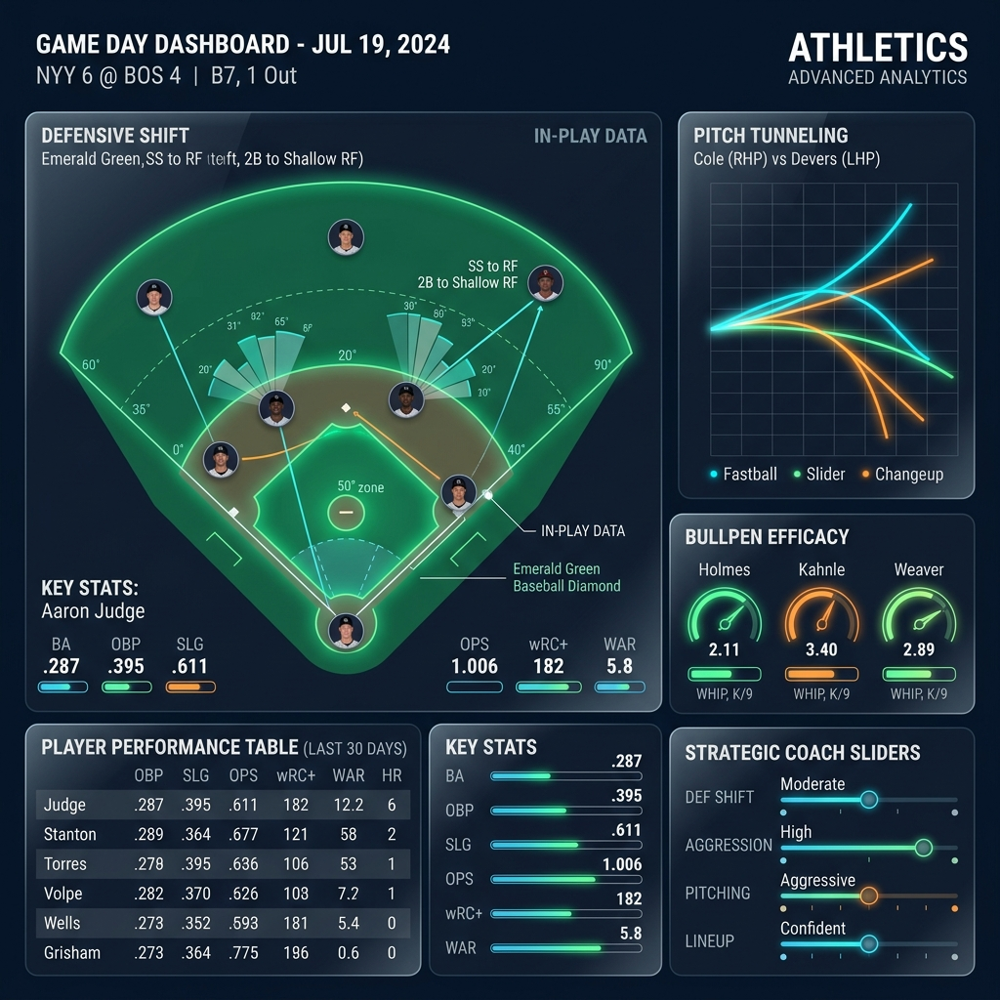

# Human-Behavior-Aware Baseball Optimizer API & Thematic Dashboard



This is a production-grade, human-behavior-aware baseball optimization service. It integrates traditional Sabermetric baselines (OBP, SLG, OPS) with active, real-time **Human Behavioral Factors** (biological fatigue, loss of sleep, stress/anxiety baselines) and **Ballpark Environment Physics** (wind vector velocity, wind direction, stadium elevation) to output optimal lineups, tactical substitution choices, bullpen recommendations, steal probabilities, and defensive shifts on-the-fly.

---

## 1. Directory Structure

The repository is structured as a standard modular Python package:

```
baseball_optimizer/
│
├── app/
│   ├── __init__.py
│   ├── calculator.py       # core math formulas (Fatigue, Wind, Stress, Steal probability, Defensive shift alignment)
│   ├── database.py         # SQLite connection setup and declarative SQLAlchemy models
│   ├── main.py             # FastAPI routing registry, DB seeder, generic player retrieval, and rotating logging setup
│   ├── schemas.py          # Pydantic v2 schemas validating request/response shapes
│   └── scrapers.py         # Stats crawler wrapper compatible with pybaseball
│
├── static/
│   ├── index.html          # Dynamic, themed HTML/CSS/JS frontend served via "/"
│   └── dashboard_preview.png # Visual mockup of the dashboard in action
│
├── tests/
│   ├── verify.py           # Programmatic ASGI baseline integration test suite
│   ├── verify_advanced.py  # Advanced matchup, physical metrics, tolls, and overrides verification
│   ├── verify_extra.py     # Biophysical, weather, strategic, and baserunning modulators verification
│   └── e2e/                # E2E test suite (e.g. test_advanced_variables.py)
│
├── logs/
│   └── baseball_optimizer.log  # Rotating log outputs
│
├── readme.md               # Quickstart and directory guide
├── gemini.md               # Instruction set to recreate the application
└── .gitignore              # Git ignore rules
```

---

## 2. Dynamic Features

### Rotatable Log Logging
Logs are automatically written to `logs/baseball_optimizer.log` utilizing python's `RotatingFileHandler`. 
* **Backup Strategy**: Logs are limited to a maximum size of **5 MB**, retaining the **3** most recent logs in an active rotatable list.
* **Console Sync**: Log events are printed to stdout in parallel for immediate CLI monitoring.

### Biophysical & Weather Physics
* **Dome/Closed Roof weather clamping**: Standardizes temperature to 72.0°F, humidity to 50%, and wind to 0 mph when a roof is closed.
* **Aerodynamic Drag**: Computes metric air density based on barometric pressure and temperature, applying carry/drag adjustments to the ballpark factor.
* **Heat Index Fatigue Tax**: Compounds game fatigue by a 1.5x multiplier when game temperature exceeds 85°F and relative humidity exceeds 70%.

### Strategic Matchups
* **Times Through the Order Penalty (TTOP)**: STARTER pitchers experience progressive command and movement drops on their 2nd (5%), 3rd (12%), and 4th+ (20%) times facing the batting order.
* **Submarine/Sidearm Platoon Splits**: Left/Right platoon splits are compounded further against submarine and sidearm pitchers.
* **Twilight visibility glare**: Games starting in twilight (hours 16-18) introduce a sunset glare visibility penalty tracking tax to batter OPS in innings 3 & 4.

### Baserunning Modulators
* **Hold Runner Rating & Slide step**: Reduces lead-off efficiency and shortens pitcher delivery time, successfully lowering base stealing probability.

### Manager's Eye / Scout Feel Observations (Optional Toggle)
Managers, Coaches, and GMs can toggle and configure qualitative observations that aren't captured by raw statistics:
* **Pitcher Composure**: Tracks pitcher mental rhythm. `Cruising` boosts command (+10%) and movement (+5%). `Rattled` reduces command (-20%), movement (-10%), and velocity (-1.5 mph).
* **Pitcher Tipping Pitches**: Indicates if the opposing pitcher is tipping their pitches. When active, batters gain a contact advantage (OBP +0.040, SLG +0.060) and pitcher command/movement drops by 15%/10%.
* **Batter Focus State**: Reflects hitter dugout presence. `Locked-In` increases swing speed (+5%) and contact (OBP +0.030) while halving anxiety. `Anxious` decreases swing speed (-5%) and contact (OBP -0.030) while doubling anxiety. `Sluggish` decreases swing speed (-8%).
* **Swing Path Adjustment**: Manual swing adjustments. `Shortened` compact stroke boosts contact (OBP +0.035, SLG -0.060). `Power Cut` big cut swings for carry (OBP -0.045, SLG +0.090).

### Color-Themed Responsive Dashboard
An interactive single-page application is hosted at the root path `/` and supports both **desktop** and **mobile** screen dimensions:
* **Interactive Controls**: Forms to adjust stadium weather patterns (temp, wind, direction), philosophy overrides (fatigue caps, friction tax), and active/natural delivery patterns of opposing pitchers.
* **Advanced Decision Panels**: Real-time interactive components for Bullpen relief optimizations, Base running steal probability simulations, and Infield/Outfield defensive shift alignments.
* **Flipping Themes**: Swapping team scopes dynamically shifts the CSS variable styles to reflect the team's colors (Cubs, Red Sox, Yankees, Dodgers, Giants).
* **Light & Dark Mode**: A header toggle switches between custom, styled dark and light variants of each team's color palette.
* **Interactive Dugout Management Panel**: Dynamic select-and-set dugout observation interface. Instantly edit a player's mental focus ("Locked-In", "Sluggish", "Anxious") and swing path ("Shortened", "Power Cut", "Standard") to save state to database and auto-reoptimize all lineups.
* **Opposing Pitcher Scouting Panel**: Live composure ("Cruising", "Rattled") and tipping overrides impacting lineup and tactical subs.
* **Pitch Tunneling & Sequence Simulator**: Timeline tracking of the current at-bat pitch history combined with next pitch optimal recommendations based on tunneling physics and catcher framing metrics.
* **Live ML Feature Importance Explainer**: Local and global machine learning model feature importance explainer, displaying feature impact (swing angle, speed, bat weight, sprint speed) on player-specific adjusted OBP/SLG/OPS.

---

## 3. Core API Endpoints

### Category I: System Configuration Control
*   `GET /api/v1/config` -> Returns the currently loaded runtime environment parameters, active team, and managerial philosophy.
*   `POST /api/v1/config/swap-context` -> Ingests a new team configuration payload. Instantly flips the database active context (Cubs, Red Sox, Yankees, etc.), reloading rosters and stadium profiles.
*   `GET /api/v1/players` -> Returns all seeded players in the database, optionally filtered by `team_id` or `position` to populate dynamic UI lists.

### Category II: Tactical Roster Optimization
*   `GET /api/v1/optimize/lineup` -> Ingests the opposing pitcher's hand ("L"/"R"), active release mechanics, physical location, and situational leverage ("normal"/"high"). Returns a dynamically sorted, 1-through-9 batting order optimized by computed physical/behavioral matchup calculations, auto-optimizing stances and grips under mechanical adaptation tolls.

### Category III: Live-Game Decision Support
*   `POST /api/v1/optimize/tactical-sub` -> Ingests a live game state snapshot. Evaluates the bench candidates and returns a recommendation (`INSERT_PINCH_HIT` or `HOLD`) with a complete mathematical reasoning summary.

### Category IV: Pitching, Baserunning, & Defensive Positioning
*   `GET /api/v1/optimize/bullpen` -> Evaluates bullpen relievers against an opposing hitter, factoring in stamina fatigue, platoon splits, and arm compatibility to recommend the best relief options.
*   `POST /api/v1/optimize/steal` -> Computes base stealing success probability based on runner sprint metrics matched against pitcher release speed and catcher pop time.
*   `POST /api/v1/optimize/defensive-shift` -> Recommends optimal infield shifts and outfield depth shifts against the active batter's launch angle and swing properties.

---

## 4. Run & Verify

1.  **Launch the Server**:
    ```bash
    uvicorn app.main:app --host 127.0.0.1 --port 8080 --reload
    ```
2.  **Access the Dashboard**:
    Open `http://127.0.0.1:8080/` in your browser.
3.  **Run Baseline Tests**:
    ```bash
    python tests/verify.py
    ```
4.  **Run Advanced Matchup & Toll Tests**:
    ```bash
    python tests/verify_advanced.py
    ```
5.  **Run Biophysical, Weather, & Strategic Modulators Verification**:
    ```bash
    python tests/verify_extra.py
    ```
6.  **Run E2E Automation Test Suite**:
    ```bash
    pytest tests/e2e
    ```
